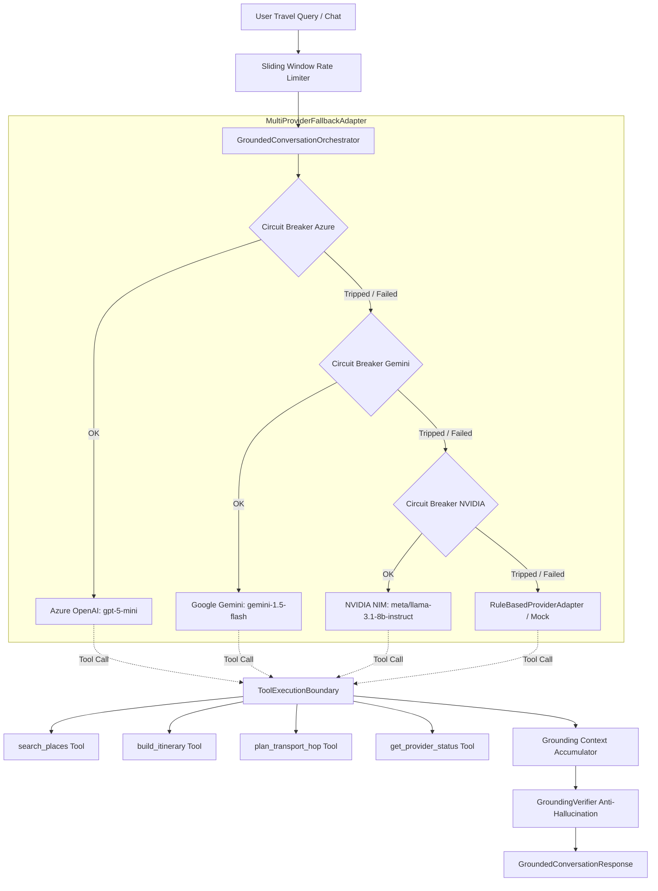

# O-Travelz — Authoritative AI Architecture & Grounding Engine
**Version:** 1.0.0 (AI System Specifications)  
**Modules:** `backend/app/ai/*`  
**Guiding Principle:** **Zero-Cost Budget Guard + Zero-Fabrication Domain Grounding**

---

## 1. Multi-Provider Adapter Architecture

The O-Travelz AI system is engineered to be completely provider-neutral. It avoids coupling the domain logic to any vendor SDK by using Python's standard `urllib.request` for OpenAI-compatible and Google Gemini REST endpoints.

---

## 2. Supported Provider Adapters

| Provider | Adapter Class | Model Default | Role / Priority | Auth Method |
| :--- | :--- | :--- | :--- | :--- |
| **Azure OpenAI** | `AzureOpenAIProviderAdapter` | `gpt-5-mini` | **Primary** (Free Tier/Credits) | `api-key` header |
| **Google Gemini** | `GeminiProviderAdapter` | `gemini-1.5-flash` | **Secondary** (Zero-cost free tier) | `x-goog-api-key` header |
| **NVIDIA NIM** | `NVIDIAProviderAdapter` | `meta/llama-3.1-8b-instruct` | **Tertiary** (Free build credits) | `Authorization: Bearer` |
| **Rule-Based Fallback** | `RuleBasedProviderAdapter` | `deterministic-odisha-rules` | **Zero-Cost / Offline Safety** | None (Local Python) |
| **Mock Adapter** | `MockProviderAdapter` | `deterministic-offline-mock` | **CI / Unit Test Isolation** | None (In-memory) |

---

## 3. Resilience, Latency Budget & Circuit Breaker

1. **Global Request Latency Budget:** Configured to `8000ms` (`AI_REQUEST_LATENCY_BUDGET_MS`). If external provider calls exceed this window or remaining time drops below 300ms, the system fast-fails over to the offline rule engine.
2. **Circuit Breaker:**
   * **Failure Threshold:** 3 consecutive failures (`AI_CIRCUIT_BREAKER_FAILURE_THRESHOLD`).
   * **Cooldown:** 30 seconds (`AI_CIRCUIT_BREAKER_COOLDOWN_SECONDS`).
   * **Behavior:** When open, queries bypass failing providers immediately without wasting network latency.
3. **Secret Masking:** Provider status endpoints and logging routines strictly strip API keys and deployment secrets, exposing only diagnostic metadata (`configured: true`, `available: true`, `model: "..."`).

---

## 4. Pluggable Tool Registry & Execution Boundary

The AI orchestrator cannot interact directly with databases or arbitrary APIs. It must invoke tools strictly through `ToolExecutionBoundary`:

* **`search_places`**: Queries verified Odisha places matching keywords, categories, districts, or geographic radius.
* **`build_itinerary`**: Invokes the deterministic `ItineraryService` with validated `PlanningConstraints`.
* **`plan_transport_hop`**: Computes point-to-point transit routes via `TransportService`.
* **`get_provider_status`**: Inspects transit status for Mo Bus, Mo E-Ride, and intercity corridors.

---

## 5. Grounding & Anti-Hallucination Verification

1. **Multilingual Taxonomy Parsing:** Supports Odia, Hindi, English, and transliterated queries. Resolves phonetic place names (e.g. "Jagannath Mandir", "Puri Beach", "ଜଗନ୍ନାଥ ମନ୍ଦିର") to canonical database identities.
2. **`GroundingVerifier` Sanitization Pass:**
   * Validates every claim in the generated AI response against facts in `GroundingContext`.
   * Strips ungrounded statements or appends explicit disclaimer warnings.
   * Guarantees that no non-existent destination or unsupported transit route is presented as fact.

---

## 6. Frontend Consumption & Integration Invariant

* **State Store:** `frontend/src/store/useAIConversation.ts` communicates with `POST /ai/converse` (or `POST /ai/plan`).
* **Components:** `AIConversationPanel` (inside Planner tab) and `AISidebar` (slide-over drawer).
* **CRITICAL INVARIANT:** The frontend redesign in Stitch must preserve the exact JSON contracts returned by `GroundedConversationResponse` (e.g. `message`, `itinerary`, `places`, `tool_calls`, `is_grounded`, `warnings`).
