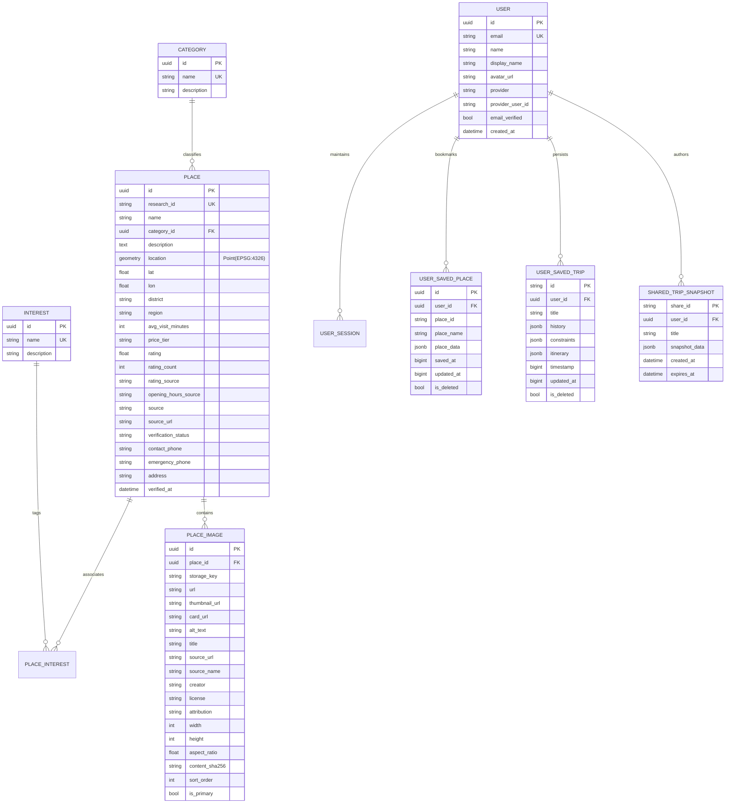

# O-Travelz — Authoritative Data Model, Places Catalog & Asset Pipeline
**Version:** 1.0.0 (Data & Domain Specifications)  
**Database:** PostgreSQL 16 with PostGIS extension  
**ORM:** SQLAlchemy 2.0 (`backend/app/models/`) & Pydantic v2 Schemas (`backend/app/schemas/`)

---

## 1. Database Schema & Entity Relationships

---

## 2. The 6 Canonical Travel Regions of Odisha

Every destination in O-Travelz is authoritatively mapped to one of the 6 canonical travel regions:

1. **Bhubaneswar & Central Heritage:** Khordha, Cuttack, Puri (Golden Triangle corridor), Dhauli, Pipli.
2. **Puri & Coastal Marine:** Puri town, Golden Beach, Konark Marine Drive, Chandrabhaga, Astaranga.
3. **Chilika & Southern Coast:** Chilika Lagoon (Satapada, Barkul, Rambha, Mangalajodi), Gopalpur, Ganjam.
4. **Kandhamal & Southern Hills:** Daringbadi ("Kashmir of Odisha"), Phulbani, Belghar, Eastern Ghats pine forests.
5. **Koraput & Tribal Highlands:** Deomali Peak, Gupteswar, Duduma Falls, Rayagada, Jeypore, Malkangiri.
6. **Sambalpur & Western Odisha:** Hirakud Dam, Debrigarh Sanctuary, Nrusinghanath, Balangir, Bargarh.
7. **Northern Odisha & Wildlife Forests:** Similipal Biosphere Reserve, Baripada, Keonjhar (Khandadhar), Mayurbhanj.

---

## 3. The 13 Physical Categories & 12 Traveler Interests

### 3.1 Physical Categories (`CANONICAL_CATEGORIES`)
1. `temple` (Temples & Sacred Shrines)
2. `monument` (Monuments, Forts & Caves)
3. `nature` (Hills, Valleys & Nature)
4. `beach` (Beaches & Coastal Shoreline)
5. `wildlife` (Wildlife Sanctuaries & National Parks)
6. `waterfall` (Waterfalls & Cascades)
7. `museum` (Museums & Art Galleries)
8. `lake` (Lakes, Lagoons & Reservoirs)
9. `market` (Traditional Markets, Handlooms & Crafts)
10. `park` (Parks & Botanical Greenery)
11. `sports_venue` (Sports Venues & Stadiums)
12. `science_center` (Science & Innovation Centers)
13. `planetarium` (Planetariums & Space Astronomy)

*(Plus Special Categories: `hospital` / `emergency_facility` and `transit_hub`)*

### 3.2 Traveler Interests (`CANONICAL_INTERESTS`)
1. `heritage` | 2. `spirituality` | 3. `architecture` | 4. `food` | 5. `culture` | 6. `nature`  
7. `beach` | 8. `wildlife` | 9. `waterfall` | 10. `relaxation` | 11. `adventure` | 12. `shopping`

---

## 4. Photographic Asset Pipeline & Image Invariants

1. **Strict 1-to-1 Semantic Binding:**
   * An authentic photograph of Konark Sun Temple is **never** reused for Lingaraj Temple.
   * If an authentic photograph for a place is absent, the system serves a **category-specific neutral editorial illustration** (never an incorrect photo of a different destination).
2. **WebP Variants:**
   * `hero.webp` (1200x800, 16:9 or 3:2, high resolution)
   * `card.webp` (800x500, optimized for grid displays)
   * `thumbnail.webp` (300x200, lightweight preview)
3. **Secure Proxy Delivery:**
   * Images are streamed via `/static/images/{storage_key}` or `/api/v1/images/{storage_key}`.
   * Path traversal (`..`) is rejected at HTTP boundary.
   * Emits `Cache-Control: public, max-age=31536000, immutable`.
   * Cloud storage credentials (Azure keys / SAS tokens) are never exposed to the client.

---

## 5. Transportation Network & Graph Model

* **Transit Adapters:**
  * `MoBusAdapter`: Real-world bus routes across Bhubaneswar, Cuttack, Puri, Khordha (CRUT network).
  * `MoERideAdapter`: First/last-mile electric feeder connectivity.
  * `WalkingAdapter`: Bounded pedestrian walking speeds (4.5 km/h) up to 2.0 km.
  * `IntercityCorridorAdapter`: Highway & rail transit times across district hubs.
* **Data Reliability Tiers (`DataTier`):**
  * `live` (Real-time tracking where supported)
  * `scheduled` (Fixed published timetable/graph)
  * `static` (Heuristic distance/time estimate)
