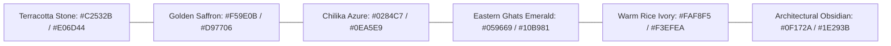

# O-Travelz — Future Design Requirements & Stitch Design Strategy
**Version:** 1.0.0 (Design System Requirements)  
**Target:** High-End Premium Travel Discovery & Deterministic Planning Platform  
**Cultural Foundation:** Authentic Heritage, Landscapes & Warmth of Odisha

---

## 1. Product Positioning & Design Philosophy

### 1.1 What O-Travelz Must Feel Like
* **A High-End Editorial Travel Companion:** Like a modern, digital National Geographic or Condé Nast Traveler, purpose-built for Odisha.
* **Culturally Grounded & Warm:** Rooted in the rich aesthetics of Kalinga temple architecture, terracotta pottery, golden beaches, and calm coastal lagoons.
* **Deterministic & Authoritative:** Instills deep trust through verified facts, real transport schedules, exact operating hours, and transparent data sources.
* **Effortlessly Intelligent:** The AI assistant feels like a knowledgeable, polite local guide who suggests tailored circuits without generic robotic clichés.

### 1.2 What O-Travelz Must NOT Feel Like
* A generic dark-mode developer dashboard.
* A crypto or cyberpunk web app.
* A clunky government portal.
* An ungrounded, hallucinating AI chat wrapper.

---

## 2. Core Design System Requirements

### 2.1 Curated Color Palette (Odisha Natural & Cultural Tones)

* **Canvas Surfaces:** Warm, premium light mode (`#FAF8F5`) as primary editorial showcase, with a deep, sophisticated dark mode (`#0B1220` refined with rich slate and warm stone borders `#1E293B`).
* **Signature Accent:** Terracotta (`#C2532B` / `#E06D44`) inspired by ancient Odishan brick craft and temple carvings.
* **Secondary Accents:** Saffron (`#F59E0B`), Chilika Azure (`#0284C7`), Forest Green (`#059669`).

### 2.2 Typography Architecture
1. **Display & Editorial Headings:** High-character serif font (e.g. *DM Serif Display*, *Playfair Display*, or *Cinzel*) for hero banners, landmark titles, and story headers.
2. **UI & Body Copy:** Clean, highly legible geometric sans-serif (*Plus Jakarta Sans* or *Inter*).
3. **Data, Coordinates & Transit Times:** Restrained, tabular monospace (*DM Mono* or *JetBrains Mono*) for flight/bus numbers, departure times, and distances.
4. **Odia Cultural Accents:** Native script integration (*Noto Sans Oriya*) for cultural landmarks and bilingual authenticity.

---

## 3. Information Architecture & Key Layout Requirements

### 3.1 Unified Navigation
* Eliminate the clutter of three simultaneous nav bars.
* Implement a single, sleek **Top Header** on desktop with high-contrast active indicators, and a clean **Floating Bottom Bar** specifically optimized for mobile viewports.

### 3.2 Split-Screen Workspace (Desktop)
* On desktop screens (≥ 1024px), the Planner view (`#plan`) should feature a **dual-pane layout**:
  * **Left Pane (50%):** Interactive day-by-day timeline, stop details, and hop transit cards.
  * **Right Pane (50%):** Pinned, reactive Leaflet map showing the active day's exact polyline route and markers in real-time.

### 3.3 Seamless In-Context AI Assistant
* Instead of locking the AI in a drawer, provide **AI Action Pills** (e.g., *"Make this itinerary more relaxed"*, *"Add Chilika Lake on Day 2"*, *"Show budget travel options"*) directly inside the itinerary workspace.

### 3.4 Rich Destination Cards & Visual Rhythm
* Replace flat, uniform cards with rich editorial card variants:
  * **Featured Hero Cards:** Large immersive photography with gradient overlays for top UNESCO landmarks.
  * **Compact Discovery Cards:** 3:2 aspect ratio cards for fast catalog browsing.
  * **Transit Hop Cards:** Sleek connecting timeline nodes showing vehicle icon, route number, and travel duration.

---

## 4. Accessibility & Performance Requirements
* **WCAG 2.1 Level AA Compliance:** High color contrast ratio (minimum 4.5:1 for normal text).
* **Touch Targets:** Minimum 44x44px for all interactive buttons, pills, and map markers.
* **Smooth Page Weight & Performance:** WebP images with lazy loading, code-split Leaflet map chunks, and instant optimistic UI feedback.
