# O-Travelz — Complete Frontend Surface Map
**Version:** 1.0.0 (Authoritative Frontend Inventory)  
**SPA Architecture:** Hash-Based Client Routing (`window.location.hash`) inside `frontend/src/pages/ItineraryPlannerPage.tsx`  
**State Architecture:** Reactive Module Stores (`useAuth`, `useCloudSync`, `usePlaces`, `useAIConversation`, `useMapProjection`, `useItineraryPlanner`, `useSavedPlaces`, `useRecentPlaces`, `useConversationHistory`, `useWeather`)

---

## 1. Complete Page & View Inventory

```mermaid
graph TD
    Root[App Entry / TermsConsentGate] --> SPA[ItineraryPlannerPage Router]
    SPA --> V1[#discover - Odisha Hero & Curated Hubs]
    SPA --> V2[#destinations - All Destinations Directory]
    SPA --> V3[#category - Thematic Circuit Explorer]
    SPA --> V4[#map - Interactive Leaflet Explorer]
    SPA --> V5[#plan - Deterministic / AI Itinerary Workspace]
    SPA --> V6[#saved & #revisit - Saved Places & Recent History]
    SPA --> V7[#trip/shared/:id - Public Read-Only Trip Snapshot]
    SPA --> V8[#privacy, #terms, #contact - Legal & Grievance Pages]
    
    SPA -. Modals & Drawers .-> M1[PlaceDetailsModal]
    SPA -. Modals & Drawers .-> M2[AISidebar Drawer]
    SPA -. Modals & Drawers .-> M3[ShareTripModal]
    SPA -. Modals & Drawers .-> M4[ItineraryExportModal]
    SPA -. Modals & Drawers .-> M5[SettingsModal]
    SPA -. Modals & Drawers .-> M6[LocationPermissionModal]
    SPA -. Modals & Drawers .-> M7[MobileDrawer]
```

---

### View 1: Home / Discovery (`#discover`)
* **URL Hash:** `#/` or `#discover` (Default Landing)
* **Purpose:** Introduce the traveler to Odisha’s rich tourism landscape, showcase curated circuits, provide quick search, and offer one-click entry to trip planning.
* **Primary User:** First-time visitor or returning traveler seeking inspiration.
* **Primary Action:** Search for a destination or select a travel category/circuit.
* **Secondary Actions:** Click "Surprise Me" (random verified destination), change hub location, open AI assistant, navigate to Planner.
* **API Endpoints Used:**
  * `GET /places` (via `usePlaces`)
  * `GET /weather/current` (via `useWeather`)
  * `GET /places/suggestions` (autocomplete)
* **Components Used:** `TopNav`, `OdishaHero`, `HomeSections`, `WeatherCard`, `CoverflowCarousel`, `PlaceCard`, `FloatingNavigationDock`, `Footer`.
* **Loading States:** Skeleton place cards while `usePlaces` is fetching; weather loader spinner.
* **Error States:** Weather fallback card; place fetching error alert.
* **Empty States:** N/A (seeded from verified catalog).
* **Authenticated vs Anonymous:**
  * *Anonymous:* Saved destinations stored in `localStorage`.
  * *Authenticated:* Live cloud sync badge displayed in header; automatic cloud synchronization.
* **Mobile Behavior:** Hero search input collapses; Coverflow carousel becomes horizontal swipe; bottom floating navigation dock takes over header navigation.
* **Current UX Problems:** Overloaded with visual widgets (Hero, Weather, Live badges, Category pills, Carousel, Hub selectors, Revisit strips) all competing for attention simultaneously.
* **Current Visual Problems:** Heavy dark-blue background (`#0B1220`) feels like a developer tool or crypto dashboard rather than an inviting, cultural travel portal.

---

### View 2: All Destinations Directory (`#destinations`)
* **URL Hash:** `#destinations`
* **Purpose:** Complete searchable, filterable catalog of all verified Odisha destinations.
* **Primary User:** Travelers looking for specific places or filtering by district, region, category, or interest.
* **Primary Action:** Filter and search destination cards.
* **Secondary Actions:** View place details modal, view on map, plan trip with selected destination, save place.
* **API Endpoints Used:**
  * `GET /places?search=...&category=...&district=...&region=...`
  * `GET /places/suggestions?query=...`
* **Components Used:** `DestinationsPage`, `PlaceCard`, `PlaceDetailsModal`, `StarRating`, `CrowdPill`, `VerifiedBadge`.
* **Loading States:** 8-card grid skeleton loaders during debounce.
* **Error States:** "No matching places found" with clear filter button.
* **Empty States:** Friendly "No destinations match your filters" with suggestion tags.
* **Authenticated vs Anonymous:** Identical search/browse capabilities; save action triggers local storage vs cloud sync.
* **Mobile Behavior:** Filter pills wrap onto multiple horizontal scrolling rows; cards stack in single column.
* **Current UX Problems:** District and Category dropdowns take excessive screen space; filter reset is not immediately prominent.
* **Current Visual Problems:** Card borders and badges look repetitive and boxy; lack of typographic rhythm between place name and metadata.

---

### View 3: Thematic Circuit & Category Exploration (`#category`)
* **URL Hash:** `#category` (selected via category pill click)
* **Purpose:** Deep dive into specific travel themes (e.g., Temples & Shrines, Beaches, Hills, Wildlife, Food & Cuisine).
* **Primary User:** Travelers with a specific interest (e.g., heritage or eco-tourism).
* **Primary Action:** Explore curated places in that category and plan a 2-day themed circuit.
* **Secondary Actions:** "Plan Trip with Category", view place modal, view on map.
* **API Endpoints Used:** `GET /places?category=...`
* **Components Used:** `CategoryExplorePage`, `PlaceCard`, `PlaceDetailsModal`.
* **Loading States:** Category header skeleton + grid skeletons.
* **Error States:** Fallback to all categories.
* **Empty States:** "No verified destinations currently listed in this category".
* **Authenticated vs Anonymous:** Identical.
* **Mobile Behavior:** Full-width header banner with vertical list of place cards.
* **Current UX Problems:** Selecting a category doesn't deep-link with the category name in the URL hash (e.g., `#category/temple`), losing state on refresh.
* **Current Visual Problems:** Category banners use generic SVG illustrations when authentic photography exists.

---

### View 4: Interactive Map & Route Explorer (`#map`)
* **URL Hash:** `#map`
* **Purpose:** Visual geographical exploration of Odisha with verified coordinates, clusters, place markers, and route paths.
* **Primary User:** Spatial planners wanting to see where destinations sit across districts and highways.
* **Primary Action:** Click destination pins to view place summary drawer or plan route.
* **Secondary Actions:** Switch map layer (Dark/Light/Satellite), zoom to current location, filter markers by category.
* **API Endpoints Used:**
  * `POST /map/v1/projection` (Authoritative geospatial projection)
  * `GET /places`
* **Components Used:** `MapView` (Lazy loaded), `MapCanvas` (Leaflet), `MapDetailsDrawer`.
* **Loading States:** `MapLoadingFallback` spinner.
* **Error States:** Map HTTP error banner with retry button.
* **Empty States:** Center default on Bhubaneswar coordinate `[20.2961, 85.8245]`.
* **Authenticated vs Anonymous:** Identical.
* **Mobile Behavior:** Map canvas height dynamically pinned; details drawer slides up from bottom.
* **Current UX Problems:** If no itinerary is planned, map shows all 81+ pins without easy district filters on desktop.
* **Current Visual Problems:** Custom Leaflet marker styles feel clunky on high-DPI screens; popup typography is cramped.

---

### View 5: Itinerary Planner & Workspace (`#plan`)
* **URL Hash:** `#plan`
* **Purpose:** The core engine of O-Travelz. Allows building multi-day, transportation-verified itineraries through either a structured form or natural language AI.
* **Primary User:** Travelers ready to construct actionable day-by-day travel schedules.
* **Primary Action:** Submit constraint parameters (days, start hub, interests, budget) or ask the AI assistant.
* **Secondary Actions:** Switch between Timeline View and Route Hop Map; export to PDF/Print; share trip link; edit stops; view hop details.
* **API Endpoints Used:**
  * `POST /itinerary/plan` (Deterministic planner)
  * `POST /ai/plan` or `POST /ai/converse` (Grounded AI)
  * `POST /map/v1/projection` (Route visualization)
  * `POST /api/v1/trips/share` (Snapshot creation)
* **Components Used:** `ConstraintForm`, `AIConversationPanel`, `ItineraryView`, `ItineraryDaySection`, `ItineraryStopCard`, `TransportHopCard`, `MapView`, `ShareTripModal`, `ItineraryExportModal`, `PrintableItineraryView`.
* **Loading States:** `LoadingState` with animated step-by-step progress ("Analyzing distances", "Validating opening hours", "Synthesizing hops").
* **Error States:** `ErrorAlert` with actionable error code and dismiss button.
* **Empty States:** `InitialState` explaining how the deterministic engine works.
* **Authenticated vs Anonymous:**
  * *Anonymous:* Itinerary saved in local conversation history.
  * *Authenticated:* Itineraries synced to PostgreSQL cloud account.
* **Mobile Behavior:** Mode tabs (Form vs AI) sticky at top; Day timeline scrolls smoothly; hop cards collapse legs.
* **Current UX Problems:** Form is dense with multiple inputs (days, interests, start location, pace, mobility, budget); users often get overwhelmed by options before seeing results.
* **Current Visual Problems:** Dark green/emerald accent (`#06211C`) contrasts harshly with the navy canvas; day cards look repetitive.

---

### View 6: Saved Places & Recent History (`#saved` / `#revisit`)
* **URL Hash:** `#saved` or `#revisit`
* **Purpose:** Management of traveler's bookmarked destinations and chronological history of places visited/planned.
* **Primary User:** Travelers organizing their shortlist or reviewing recently explored stops.
* **Primary Action:** "Plan Trip with Saved Places" (converts saved items into an itinerary constraint).
* **Secondary Actions:** Remove bookmark, view place modal, view on map.
* **API Endpoints Used:**
  * `GET/POST /api/v1/sync/saved-places` (if authenticated)
* **Components Used:** `SavedPlacesPage`, `PlaceCard`, `PlaceDetailsModal`.
* **Loading States:** Sync spinner if cloud sync active.
* **Error States:** Sync error banner.
* **Empty States:** Illustrated empty state with "Explore Destinations" CTA.
* **Authenticated vs Anonymous:** Anonymous users see local items; authenticated users see synced cloud items.
* **Mobile Behavior:** 2-column or 1-column responsive card grid.
* **Current UX Problems:** Switch between "Saved Places" and "Recently Viewed" tabs is subtle and easy to miss.
* **Current Visual Problems:** Empty states lack cultural charm or helpful discovery prompts.

---

### View 7: Public Read-Only Shared Trip (`#trip/shared/:shareId`)
* **URL Hash:** `#trip/shared/{shareId}`
* **Purpose:** Publicly accessible, immutable read-only view of a traveler's curated itinerary.
* **Primary User:** Friends, family, or fellow travelers who received a shared link.
* **Primary Action:** "Plan My Own Trip" or copy itinerary into personal planner.
* **Secondary Actions:** View interactive route map, click stops for destination details.
* **API Endpoints Used:** `GET /api/v1/trips/shared/{share_id}`
* **Components Used:** `SharedItineraryPage`, `ItineraryView`, `MapView`, `PlaceDetailsModal`.
* **Loading States:** Dedicated loading skeleton.
* **Error States:** "Shared trip expired or not found" with button to build new trip.
* **Empty States:** N/A.
* **Authenticated vs Anonymous:** Zero authentication required; no user tokens transmitted.
* **Mobile Behavior:** Clean readable timeline with printable export option.
* **Current UX Problems:** Link sharing requires clicking "Copy Link" inside modal; no direct native web share API integration.
* **Current Visual Problems:** Header lacks distinct "Shared Trip" branded badge to distinguish from user's live workspace.

---

### View 8: Legal, Compliance & Grievance Pages (`#privacy`, `#terms`, `#contact`)
* **URL Hash:** `#privacy`, `#terms`, `#contact`
* **Purpose:** Statutory compliance with Indian IT Rules, DPDP Act 2023, grievance redressal, and transparent data policies.
* **Primary User:** Users seeking legal assurance, data deletion requests, or contact details.
* **Primary Action:** Read policies or click back to discover.
* **API Endpoints Used:** None.
* **Components Used:** `PrivacyPolicyPage`, `TermsConditionsPage`, `ContactGrievancePage`.
* **Current UX Problems:** Navigating here replaces the entire viewport; returning to the previous tab requires browser back or clicking back button.
* **Current Visual Problems:** Long walls of plain markdown text without engaging accordion navigation.

---

## 2. Interactive Modals & Slide-Over Drawers

| Modal / Drawer | Trigger | Purpose | Key Actions |
| :--- | :--- | :--- | :--- |
| **`PlaceDetailsModal`** | Click any Place Card or Stop | Deep view with photo gallery, verified coordinates, visit duration, rating, operating hours, phone contacts, and nearby suggestions | "Plan Trip with Place", "View on Map", "Save", "Close" |
| **`AISidebar`** | Floating AI Agent Dock button or Header AI icon | Slide-over conversational assistant supporting Odia, Hindi, English | Chat input, "Send", suggested quick prompt pills |
| **`ShareTripModal`** | "Share Trip" button in Itinerary Header | Generates server snapshot and displays unguessable share URL | "Copy Link", "Select Platform", "Close" |
| **`ItineraryExportModal`** | "Export" button in Itinerary Header | Exports trip to Markdown, JSON, Text, or opens browser Print preview | "Print / PDF", "Download JSON", "Download MD" |
| **`SettingsModal`** | Header Sliders icon / Mobile drawer | User preferences (Budget tier, preferred pace, travel style) | "Save Preferences", "Reset" |
| **`LocationPermissionModal`** | Header Location Pin / "Enable Live Location" | 2-step explanatory prompt for browser Geolocation API | "Allow Location", "Maybe Later", "Retry" |
| **`MobileDrawer`** | Mobile hamburger icon | Navigation drawer on small viewports | Tab links, Auth button, Settings, AI launcher |
| **`TermsConsentGate`** | First app launch (if not accepted) | Explicit compliance consent gate before entering app | "I Agree & Continue" |

---

## 3. Dead, Placeholder, Legacy, or Duplicate Code Identified

During inspection, the following components and files were identified as legacy, duplicate, or candidates for cleanup during redesign:

1. **`frontend/src/pages/DemoHome.tsx` & `frontend/src/demo/`:**
   * Contains static mock data (`mockData.ts`, `types.ts`) from Phase 0 early prototyping.
   * `App.tsx` completely ignores `DemoHome.tsx` and routes directly to `ItineraryPlannerPage.tsx`.
2. **Duplicate Badges:**
   * `src/components/badges/` contains `LiveBadge.tsx`, `StatusBadge.tsx`, `VerifiedBadge.tsx`, `CrowdPill.tsx`, and `StarRating.tsx`, while several components duplicate inline badge styling.
3. **`FloatingNavigationDock.tsx` vs `TopNav.tsx`:**
   * Redundant navigation elements simultaneously visible on desktop screens, causing UI clutter.
4. **`MapPlaceholder.tsx`:**
   * Unused placeholder component superseded by `MapView.tsx` and `MapCanvas.tsx`.
