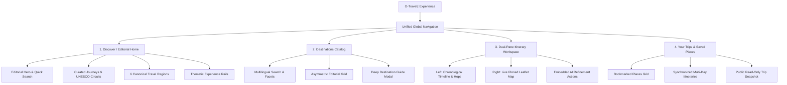

# O-Travelz — Master Stitch Design System & Product Experience Brief
**Document:** `docs/OTRAVELZ_STITCH_MASTER_DESIGN_BRIEF.md`  
**Phase:** Phase 2 — Design Strategy & Stitch Design Blueprint  
**Status:** Approved Master Specification  
**Design Philosophy:** **Editorial Travel Publication + Modern Indian Visual Language + Grounded Deterministic Intelligence**

---

## 1. Product Design Philosophy

O-Travelz is a high-end, transportation-aware travel intelligence platform purpose-built for the state of **Odisha, India**.

### 1.1 The Core Thesis
Travel platforms usually fall into two broken extremes:
1. **The Overdecorated Tourism Portal:** Antiquated government portals filled with low-res static flyers, broken links, and zero functional trip utility.
2. **The Sterile AI SaaS Dashboard:** Dark `#0B1220` backgrounds, neon cyan glow effects, generic purple gradient bubbles, and hallucinated ChatGPT itineraries disconnected from transit reality.

O-Travelz rejects both extremes. It embraces:
* **The High-End Travel Publication:** Evocative, large-format editorial photography, elegant serif headlines, generous white space, and rich cultural essays (like *Condé Nast Traveler* or *National Geographic Odyssey*).
* **The Deterministic Engineering Machine:** Behind the warm editorial surface sits a verified spatial routing engine that guarantees physical feasibility, exact road/rail distances, Mo Bus public transit hops, and verified opening hours.
* **Modern Indian Craft & Warmth:** Drawing subtle, refined inspiration from ancient Kalinga stone masonry, terracotta temple friezes, golden Bay of Bengal sunrises, and tranquil Chilika brackish waters—without ever descending into folkloric clutter or kitsch.

---

## 2. Brand Personality & Tone of Voice

| Dimension | What O-Travelz Is | What O-Travelz Is NOT |
| :--- | :--- | :--- |
| **Aesthetic** | Warm, editorial, tactile, sunlight-washed, crisp | Dark SaaS, crypto dashboard, neon cyberpunk |
| **Intellect** | Authoritative, verified, geographically grounded | Vague, hallucinated, robotic, generic AI chatbot |
| **Heritage** | Deeply Odishan, respectful, nuanced, local | Over-decorated, kitsch, cliché, generic Bollywood |
| **Utility** | Action-oriented, transit-aware, seamless, practical | Theoretical, chatty, overwhelming, form-heavy |
| **Tone** | Inviting, knowledgeable local guide, cultured | Corporate, tech-bro, transactional, robotic |

---

## 3. Core Visual Language

### 3.1 Principles of Materiality & Surface
* **Warm Rice & Stone Surfaces:** The UI rests primarily on a warm, tactile ivory canvas (`#FAF8F5`) layered with crisp chalk-white cards (`#FFFFFF`) and warm stone borders (`#E7E1D8`).
* **Subtle Architectural Elevation:** Elevation is achieved through soft, diffused, multi-layered ambient shadows (`box-shadow: 0 4px 20px -2px rgba(30, 24, 18, 0.05)`) and delicate 1px hairline borders (`#E7E1D8`), completely eliminating heavy glowing outlines and exaggerated 24px corner roundings.
* **Spatial Rhythm:** Generous whitespace, asymmetric editorial layouts, vertical rule lines, and structured column grids inspired by classic broadsheet and magazine publishing.

---

## 4. Master Color System (Odisha Natural & Cultural Palette)

The color palette is strictly disciplined. Neutrals carry 80% of the UI surface; brand accents are applied with deliberate intentionality.

```
┌────────────────────────────────────────────────────────────────────────┐
│                        PRIMARY EDITORIAL CANVAS                        │
│                                                                        │
│  Rice Ivory (Base): #FAF8F5         Chalk Card Surface: #FFFFFF        │
│  Warm Stone Border: #E7E1D8         Elevated Layer:     #F3EFEA        │
├──────────────────────────┬──────────────────────────┬──────────────────┤
│     SIGNATURE ACCENT     │     NATURE & WATER       │    TYPOGRAPHY    │
│                          │                          │                  │
│ Terracotta:   #C2532B    │ Chilika Azure: #0284C7   │ Obsidian: #0F172A│
│ Terracotta-Lt:#E06D44    │ Deep Lagoon:   #0369A1   │ Slate:    #334155│
│ Saffron Gold: #F59E0B    │ Ghats Forest:  #3F6B4A   │ Muted:    #64748B│
└──────────────────────────┴──────────────────────────┴──────────────────┘
```

### 4.1 Token Specification
* **`--color-canvas-bg`**: `#FAF8F5` (Warm rice ivory base)
* **`--color-surface-card`**: `#FFFFFF` (Crisp paper surface)
* **`--color-surface-elevated`**: `#F3EFEA` (Subtle warm stone container)
* **`--color-border-subtle`**: `#EFEBE4` (Light hairline separator)
* **`--color-border-default`**: `#E7E1D8` (Structural stone border)
* **`--color-border-strong`**: `#D3C9BC` (Input & active boundaries)
* **`--color-brand-terracotta`**: `#C2532B` (Signature Odishan terracotta stone)
* **`--color-brand-terracotta-hover`**: `#A74421` (Interactive focus)
* **`--color-brand-saffron`**: `#F59E0B` (Temple marigold & festival gold)
* **`--color-brand-azure`**: `#0284C7` (Chilika Lake & Bay of Bengal waters)
* **`--color-brand-forest`**: `#3F6B4A` (Eastern Ghats & Similipal canopy)
* **`--color-text-primary`**: `#0F172A` (Deep ink obsidian)
* **`--color-text-secondary`**: `#334155` (Refined dark slate)
* **`--color-text-muted`**: `#64748B` (Neutral metadata gray)

---

## 5. Master Typography Architecture

Typography is the primary vehicle of brand elegance in O-Travelz.

| Role | Font Family | Weights | Usage & Tracking |
| :--- | :--- | :--- | :--- |
| **Display & Editorial** | `DM Serif Display` | Regular (400), Italic | Landmark titles, Hero headlines, Section headers, Story openers (`letter-spacing: -0.015em`) |
| **Interface & Body** | `Plus Jakarta Sans` | Light (300), Regular (400), Medium (500), SemiBold (600), Bold (700) | UI labels, narrative descriptions, navigation, cards, modal dialogs (`letter-spacing: -0.01em`) |
| **Technical & Transit** | `DM Mono` | Medium (500), SemiBold (600) | Departure times, transit hop numbers, GPS coordinates, distance tags, pricing (`tabular-nums`) |
| **Odia Native Script** | `Noto Sans Oriya` | Regular (400), SemiBold (600) | Native cultural landmark titles, bilingual search suggestions |

---

## 6. Photographic Art Direction & Asset Binding

1. **Authentic Photographic Integrity:** No stock models on generic beaches. Imagery must showcase real Odisha: the Sun Temple chariot wheels at dawn, fishermen on Chilika at twilight, misty pine valleys of Daringbadi, and the intricate terracotta carvings of ancient shrines.
2. **Aspect Ratio Standards:**
   * **Hero Feature:** `16:9` or `21:9` wide cinematic crops with subtle linear gradients (`to bottom, transparent 60%, rgba(15, 23, 42, 0.7)`).
   * **Destination Card:** `3:2` or `4:3` golden-ratio editorial cards.
   * **Transit / Stop Thumbnail:** `1:1` square rounded-md previews.
3. **Backend Asset Proxy Invariant:** All production renders map strictly to `/static/images/{storage_key}`.

---

## 7. Global Navigation Architecture

### 7.1 Desktop Header (Streamlined & Architectural)
Eliminates the previous multi-dock chaos. A single, refined sticky header (`h-18` / 72px):
```
[ O-TRAVELZ Logo ]  ·  Discover  ·  Destinations  ·  Map  ·  Plan Trip  ·  Your Trips    │    [ 🔍 Search ]  [ 🔖 Saved (3) ]  [ 👤 Sign In ]
```
* **Active State:** Clean terracotta underline indicator (`border-b-2 border-[#C2532B] font-semibold text-[#0F172A]`).
* **Location Context:** Subtle, elegant badge (`📍 Puri, Odisha`) with 1-click hub switch popover.

### 7.2 Mobile Navigation (Focused 4-Tab Bottom Bar)
* Pinned bottom navigation bar (`h-16` / 64px) with high-contrast active icons:
  1. **Discover** (Compass icon)
  2. **Destinations** (Grid icon)
  3. **Plan / Map** (Route icon)
  4. **Trips & Saved** (Bookmark icon)
* Top mobile bar contains brand lockup, search trigger, and location indicator.

---

## 8. Information Architecture



---

## 9. Homepage Composition (`SCR-13`)

The homepage is an editorial gateway, structured into 6 storytelling sections:

1. **Hero Landmark Showcase (`100vh - 72px`):**
   * High-impact full-bleed photography of Konark Sun Temple or Puri Golden Beach at sunrise.
   * Large editorial headline in *DM Serif Display*: *"Discover the Soul of Odisha"*.
   * Elevated single-bar search module with live autocomplete (Odia/Hindi/English) and quick departure hub selector.
2. **Curated Signature Circuits (The Golden Triangle & Beyond):**
   * Asymmetric 3-card layout highlighting pre-built 2-day and 3-day journeys with estimated transit duration and budget.
3. **Explore by Thematic Experience (Horizontal Rail):**
   * Large cards for Temples & Shrines, Coastal Escapes, Wildlife Sanctuaries, Waterfalls, and Culinary Heritage.
4. **The 6 Geographical Regions of Odisha:**
   * Interactive region carousel: Central Heritage, Southern Coast, Eastern Ghats Highlands, Tribal Hills, Western Corridors, Northern Biosphere.
5. **Interactive Quick Planner Prompt:**
   * *"Got a weekend? Build a customized circuit in 30 seconds."* — One-click starter buttons.
6. **Editorial Footer:**
   * Authentic cultural footer with state hub intelligence, weather status, and statutory compliance links.

---

## 10. Destination Discovery & Detail Architecture (`SCR-14`, `SCR-15`)

### 10.1 Catalog Grid (`SCR-14`)
* **Asymmetric Editorial Layout:** Features a lead "Destination of the Week" hero card followed by a balanced 3-column responsive grid.
* **Instant Facets:** Region chips, category selector, visit duration filters, and verified crowd/status indicators.

### 10.2 Destination Detail View (`SCR-15`)
* **Header:** Full-width cinematic hero image with multi-angle photo gallery carousel and verified photographer attribution.
* **Editorial Overview:** Name in *DM Serif Display*, Odia native script subtitle, curated historical/cultural narrative.
* **Verified Intelligence Grid:**
  * **Timing:** Recommended visit duration (`avg_visit_minutes`), opening hours with verified source link.
  * **Location:** District, region, exact GPS coordinates, and distance from user hub.
  * **Pricing & Phone:** Price tier badge, verified contact and emergency helpline.
* **Action Strip:** Sticky action bar with:
  * `[ ✦ Plan Itinerary Around This Place ]` (Primary Terracotta)
  * `[ 🗺️ View on Map ]` (Secondary Stone)
  * `[ 🔖 Save Bookmark ]` (Ghost)
* **Nearby Places:** 4-card horizontal rail of verified places within 25km radius (PostGIS spatial query).

---

## 11. Interactive Map Architecture (`SCR-17`)

### 11.1 Desktop Dual-Pane Workspace
* **Layout Ratio:** 50% Left Pane (Chronological Itinerary / Place List) | 50% Right Pane (Interactive Leaflet Map).
* **Synchronized States:** Hovering over a stop in the timeline highlights the corresponding map pin with an animated pulse and popup.
* **Route Polylines:** Real-world road/rail geometries connecting stops, color-coded by transit mode (Mo Bus: `#0284C7`, Walking: `#10B981`, Intercity Car: `#C2532B`).

### 11.2 Mobile Map Architecture
* Full-screen map with draggable bottom sheet for stop inspection and navigation directions.

---

## 12. AI Travel Copilot Experience (`SCR-20`, `SCR-21`, `SCR-22`)

### 12.1 The Embedded Copilot Philosophy
O-Travelz does **not** use a detached chatbot window. AI is woven directly into the workspace as a smart assistant:
* **Contextual Action Chips:** Inside the itinerary view, the user sees smart suggestion pills:
  * `[ ✦ Add sunset stop at Puri Beach ]`
  * `[ ✦ Adjust pace to relaxed ]`
  * `[ ✦ Show authentic Odia thali lunch spots nearby ]`
  * `[ ✦ Reduce transit travel budget ]`
* **Grounded Answer Cards (`SCR-21`):** When asking the AI assistant, the response returns verified destination cards with direct `[ Add to Day 1 ]` or `[ View Route ]` buttons.
* **Zero-Fabrication Badges:** Every recommendation displays a `Verified Grounded Fact` indicator citing authoritative catalog data.

---

## 13. Itinerary & Multi-Day Timeline Architecture (`SCR-19`)

### 13.1 Chronological Journey Storytelling
The itinerary view tells the continuous narrative of each travel day:

```
[ Day 1: Ancient Temples & Architectural Wonders of Bhubaneswar ]
─────────────────────────────────────────────────────────────────
08:30 AM  ●── [ Lingaraj Temple ] ──────────────── (Visit: 90 min)
              11th-century Kalinga architecture masterpiece
              
          │   🚌 Mo Bus Route 10  ·  15 min  ·  ₹20  [Scheduled Tier]
          ▼
10:15 AM  ●── [ Mukteshvara Temple ] ──────────── (Visit: 60 min)
              "Gem of Odisha Architecture" with sculpted stone torana

          │   🚶 Scenic Old Town Walk  ·  8 min  ·  500m
          ▼
11:30 AM  ●── [ Bindu Sagar Lake & Old Town Food Hub ] (Visit: 45 min)
              Traditional Dalma lunch & temple prasad
```

* **Transit Hop Cards:** Styled as connecting narrative bridges between stops, showing travel duration, fare estimate, and vehicle type.
* **Workspace Action Toolbar:** Sticky header with `[ ↗ Share Trip ]`, `[ 🖨️ Export PDF ]`, `[ + Add Destination ]`, and `[ 🔄 Reorder Stops ]`.

---

## 14. Trip Planner Progressive Architecture (`SCR-18`)

Replaces the monolithic constraint form with an elegant 3-step progressive builder:
1. **Step 1: Focus & Starting Hub:** Where do you start? *(Bhubaneswar, Puri, Konark, etc.)*
2. **Step 2: Duration:** How many days? *(Interactive slider: 1 to 7 Days)*
3. **Step 3: Travel Desires:** Select 2–3 interests *(Heritage, Beaches, Wildlife, Food, Nature)*.
4. **Immediate Generation:** Click `[ Generate Curated Odisha Itinerary ]` to render the dual-pane timeline and map.

---

## 15. Trips, Sharing & Account Architecture (`SCR-24`, `SCR-25`, `SCR-26`, `SCR-31`)

### 15.1 Your Trips & Bookmarks (`SCR-24`, `SCR-25`)
* Clean personal travel dashboard displaying active trips, past planned journeys, and bookmarked destinations.
* Cloud sync status badge (`● Synced with Google Account`) with offline indicator.

### 15.2 Public Read-Only Shared Trip (`SCR-31`)
* When opening `https://otravelz.in/#trip/shared/{share_id}`, the recipient sees a pristine, magazine-quality itinerary document.
* **Header:** Traveler’s trip title, date range, starting hub, and total stops count.
* **Interactive Elements:** Full multi-day timeline, interactive route map, and destination photos.
* **Zero Barrier:** No login or app download required.
* **Conversion CTA:** Prominent `[ ✦ Plan Your Own Odisha Journey ]` button.

---

## 16. Reusable Stitch UI Primitives System

Phase A of Stitch generation establishes these 12 foundational design primitives:

1. **`PRM-01` Buttons:** Primary Terracotta (`#C2532B`), Secondary Warm Stone (`#F3EFEA`), Ghost Obsidian, and Icon Buttons.
2. **`PRM-02` Badges & Status:** Verified Catalog Badge, Live Weather Pill, Crowd Tier, Rating Star, and Transit Data Tier (`Live`, `Scheduled`, `Static`).
3. **`PRM-03` Editorial Destination Cards:** Large Feature Hero Card, Standard 3:2 Grid Card, Horizontal Discovery Rail Card.
4. **`PRM-04` Itinerary Stop Card:** Chronological timeline node with arrival/departure times, visit duration chip, and place thumbnail.
5. **`PRM-05` Transit Hop Connector:** Connecting vertical bridge showing mode icon (Bus, Walk, Auto), route line, duration, and fare.
6. **`PRM-06` Chips & Filter Pills:** Category pills, region selectors, interest tags, and AI action chips.
7. **`PRM-07` Inputs & Search Modules:** Single-bar search input with debounced dropdown, numeric stepper for days, and hub selector.
8. **`PRM-08` Modal & Slide-Over Shell:** Unified dialog wrapper with backdrop blur, smooth exit animations, and 44px close targets.
9. **`PRM-09` Map Popups & Custom Pins:** High-DPI Leaflet marker icons with category-colored pins and preview popups.
10. **`PRM-10` Weather Widget:** Minimal observation card with animated SVG weather icons, temperature, and dynamic travel advice.
11. **`PRM-11` AI Message Bubble & Grounded Result Card:** Assistant speech bubble with embedded verified place recommendations.
12. **`PRM-12` Loading Skeletons:** Shimmer placeholders for cards, timelines, and map viewports.

---

## 17. Stitch Screen Generation Sequence (31 Surfaces)

To ensure visual coherence and design token inheritance, Stitch screens must be generated strictly in the following 5 phases:

```
┌────────────────────────────────────────────────────────────────────────┐
│                        STITCH GENERATION PHASES                        │
├────────────────────────────────────────────────────────────────────────┤
│ PHASE A: FOUNDATION & DESIGN PRIMITIVES (Screens 01 - 12)             │
│   01. Master Design Tokens & Scale                                     │
│   02. Global Header & Mobile Bottom Nav                                │
│   03. Responsive Layout Grid Shell                                     │
│   04. Button & Interactive States                                      │
│   05. Badges, Live Pills & Rating Stars                                │
│   06. Editorial Destination Card Primitives                            │
│   07. Itinerary Stop & Hop Card Primitives                             │
│   08. Filter Chips & AI Action Pills                                   │
│   09. Form Controls & Search Input Module                              │
│   10. Modal Dialog & Slide-Over Drawer Shell                           │
│   11. Map Pins, Popups & Layer Controls                                │
│   12. Weather Widget & Status Cards                                    │
├────────────────────────────────────────────────────────────────────────┤
│ PHASE B: CORE PRODUCT EXPERIENCES (Screens 13 - 19)                    │
│   13. Editorial Homepage & Hero Landmark Showcase                      │
│   14. Destinations Catalog & Multi-Filter Directory                    │
│   15. Destination Detail Guide & Gallery Modal                         │
│   16. Autocomplete Search Overlay                                      │
│   17. Dual-Pane Map & Spatial Route Workspace                          │
│   18. Progressive Trip Planner Builder                                 │
│   19. Multi-Day Itinerary Workspace & Timeline                         │
├────────────────────────────────────────────────────────────────────────┤
│ PHASE C: INTELLIGENT TRAVEL COPILOT (Screens 20 - 22)                  │
│   20. Embedded AI Assistant Interface & Prompts                        │
│   21. Grounded AI Destination Recommendation Cards                     │
│   22. AI Itinerary Refinement & Modification Flow                      │
├────────────────────────────────────────────────────────────────────────┤
│ PHASE D: USER TRIPS & SHARING (Screens 23 - 26)                        │
│   23. Saved Places & Bookmarks Catalog                                 │
│   24. Saved Multi-Day Itineraries Dashboard                            │
│   25. Share Trip Modal & Snapshot Link Generator                       │
│   26. Google OAuth Sign-In Dialog & Cloud Sync Settings                │
├────────────────────────────────────────────────────────────────────────┤
│ PHASE E: SYSTEM STATES & PUBLIC SURFACES (Screens 27 - 31)            │
│   27. Shimmer Loading Skeletons Matrix                                 │
│   28. Empty Discovery & Search Results States                          │
│   29. Actionable Error Banners & Fallback Alerts                       │
│   30. Offline Network Failure & Reconnection State                     │
│   31. Public Read-Only Shared Trip Snapshot Page                       │
└────────────────────────────────────────────────────────────────────────┘
```

---

## 18. Detailed Stitch Prompt Blueprints (Screen-by-Screen)

### Blueprint 1: `SCR-13` Editorial Homepage & Hero Landmark Showcase
* **Purpose:** Primary landing experience establishing O-Travelz as the premier, authentic travel platform for Odisha.
* **Layout:**
  * Top navigation bar with warm stone border.
  * Hero section featuring full-bleed photography of Konark Sun Temple at golden hour with warm gradient overlay.
  * Headline: *"Discover the Soul of Odisha"* in *DM Serif Display* (56px, white).
  * Subtitle: *"Curated cultural circuits, verified heritage routes, and intelligent multimodal itineraries."* in *Plus Jakarta Sans* (18px, rice ivory).
  * Floating central search box: Departure Hub dropdown (`Bhubaneswar`), search input (`Search temples, beaches, waterfalls...`), and Terracotta CTA button (`[ Explore Journeys ]`).
  * Horizontal live weather ticker for 6 hubs (Puri, Konark, Chilika, Daringbadi, Koraput, Sambalpur).
  * 3 Signature Curated Circuits with route map miniatures and duration badges.
  * 6-card thematic experience rail.
* **Palette:** Canvas `#FAF8F5`, Hero text `#FFFFFF`, Accents `#C2532B` and `#F59E0B`, Borders `#E7E1D8`.
* **Anti-Patterns:** No neon glow, no robotic chatbox on the hero, no dark dashboard styling.

### Blueprint 2: `SCR-19` Dual-Pane Itinerary Workspace & Interactive Timeline
* **Purpose:** Core trip workspace displaying multi-day schedule side-by-side with interactive Leaflet map.
* **Layout (Desktop Dual-Pane):**
  * **Header:** Trip title (*"3-Day Spiritual & Coastal Odyssey"*), date range, start hub, and action toolbar (`[ ↗ Share ]`, `[ 🖨️ Export PDF ]`, `[ + Add Stop ]`).
  * **Left Pane (50% scrollable):**
    * Day selector tabs (`Day 1: Bhubaneswar Heritage`, `Day 2: Puri Marine`, `Day 3: Chilika Lagoon`).
    * Chronological timeline nodes: 08:30 AM Lingaraj Temple -> 15 min Mo Bus hop -> 10:15 AM Mukteshvara Temple -> 8 min walk -> 11:30 AM Old Town Lunch.
    * Each stop card contains place photo (1:1), title in *DM Serif Display*, duration chip, and verified badge.
    * Each hop connector shows transit mode, travel minutes, and estimated fare in *DM Mono*.
    * AI Assistant Suggestion strip at bottom of Day timeline.
  * **Right Pane (50% pinned):**
    * Interactive map showing numbered pins (1, 2, 3) connected by polyline routes.
* **Palette:** Card surfaces `#FFFFFF`, Canvas `#FAF8F5`, Hops `#0284C7`, Transit badges `#334155`, Active accents `#C2532B`.

### Blueprint 3: `SCR-15` Destination Detail Guide Modal
* **Purpose:** In-depth cultural and logistical guide for any verified destination.
* **Layout:**
  * Modal dialog (max-w-4xl) with header image coverflow gallery.
  * Title in *DM Serif Display* (32px), Odia title in *Noto Sans Oriya* (16px), Category badge (`Temples & Sacred Shrines`), and Verified Checkmark.
  * 2-column body:
    * Left (60%): 3-paragraph historical narrative, architectural significance, best time to visit, and cultural etiquettes.
    * Right (40%): Verified Logistics Card: Visit Duration (`90 min`), Opening Hours (`06:00 AM – 09:00 PM`), Price Tier (`Free entry / Special Darshan ₹50`), Address, Emergency Contact, and Weather snippet.
  * Sticky Footer Bar: `[ ✦ Plan Trip With This Place ]` (Terracotta), `[ 🗺️ View on Map ]` (Stone), `[ 🔖 Bookmark ]`.
* **Palette:** Card `#FFFFFF`, Borders `#E7E1D8`, Text `#0F172A`, Muted `#64748B`.

### Blueprint 4: `SCR-31` Public Read-Only Shared Trip Snapshot
* **Purpose:** Pristine, magazine-quality public view for recipients of shared trip links (`/#trip/shared/{id}`).
* **Layout:**
  * Branded topbar with *"Shared Odisha Itinerary via O-Travelz"* badge.
  * Editorial cover banner with primary trip destination image and trip title.
  * Complete multi-day schedule with stops, arrival times, and transportation hop details.
  * Embedded interactive map view showing the full route across Odisha.
  * Prominent CTA in sticky footer: `[ ✦ Build Your Own Odisha Journey with O-Travelz ]`.
* **Zero Friction:** No sign-in modal, no cookie banners, completely responsive and print-ready.

---

## 19. Implementation Constraints & Invariants

During Stitch generation and subsequent React integration:

1. **Strict API Contract Invariant:** The existing 24 endpoints, Pydantic schemas, and JSON response models in `backend/app/schemas/` must remain unchanged.
2. **Deterministic Data Invariant:** UI components must display only verified fields (`name`, `category`, `district`, `region`, `avg_visit_minutes`, `rating`, `opening_hours_source`, `phone`, `images`). No fabricated places or fake timetables.
3. **Image Delivery Invariant:** Visual assets must continue using the existing backend proxy (`/static/images/{storage_key}`).
4. **Auth & Sync Invariant:** Google OAuth 2.0 PKCE and timestamp-based conflict resolution remain the authoritative user data pipeline.

---

## 20. Product Proposals vs. Existing Functionality

| Capability | Status in Codebase | Stitch Design Handling |
| :--- | :---: | :--- |
| **Multilingual Search (Odia/Hindi/Eng)** | **Implemented & Tested** | Design rich autocomplete overlay with script badges. |
| **Deterministic Itinerary Planning** | **Implemented & Tested** | Design progressive 3-step builder & dual-pane timeline. |
| **Multimodal Hops (Mo Bus, Walk)** | **Implemented & Tested** | Design elegant transit hop connectors with fare/time tags. |
| **Leaflet Map Projection & Pins** | **Implemented & Tested** | Design high-DPI custom marker icons and route polylines. |
| **Multi-Provider AI Fallback** | **Implemented & Tested** | Design embedded AI action chips & grounded result cards. |
| **Google OAuth & Cloud Sync** | **Implemented & Tested** | Design clean sign-in dialog and sync status indicators. |
| **Public Read-Only Trip Snapshot** | **Implemented & Tested** | Design magazine-style public itinerary view. |
| **Live Open-Meteo Weather** | **Implemented & Tested** | Design weather cards with dynamic travel advice. |
| **Interactive Hotel / Ticket Booking** | *Proposal (Future)* | **Omit from Stitch MVP.** (Focus on planning/routing). |
| **Live GPS Turn-by-Turn Navigation** | *Proposal (Future)* | **Omit from Stitch MVP.** (Map shows static route geometry). |
| **Social Community Comments / Reviews** | *Proposal (Future)* | **Omit from Stitch MVP.** (Preserve verified authority). |
