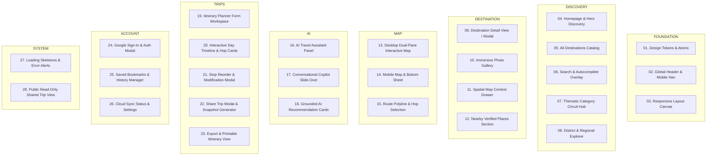

# O-Travelz — Authoritative Stitch Screen & Component Inventory
**Version:** 1.0.0 (Stitch Blueprint)  
**Total Target Screens & Views:** 28 Core Surfaces  
**Redesign Tooling Target:** Stitch Design System

---

## 1. Complete Screen Inventory by Functional Group

---

## 2. Detailed Screen Specifications

### Group 1: FOUNDATION
1. **`SCR-01` Design Tokens & Component Library:** Color tokens (Terracotta, Saffron, Azure, Sand), typography scales (Serif display, Sans body, Mono data), shadow paper elevations, and radius tokens.
2. **`SCR-02` Global Header & Responsive Navigation:** Clean topbar with brand logo, region selector, search trigger, saved counter, auth button, and mobile bottom tab bar.
3. **`SCR-03` Responsive Layout Shell:** Grid containers, sticky headers, responsive drawers, and fluid breakpoints (Mobile < 640px, Tablet 640–1023px, Desktop ≥ 1024px).

### Group 2: DISCOVERY
4. **`SCR-04` Homepage & Hero Discovery:** Immersive hero with dynamic photography, live weather widget, one-click category chips, and curated editorial circuits.
5. **`SCR-05` All Destinations Catalog:** Multi-filter directory (category, district, region, price, rating) with responsive 3-column card grid.
6. **`SCR-06` Search & Autocomplete Overlay:** Fast debounced search modal with Odia/Hindi/English keyword suggestions and typo corrections.
7. **`SCR-07` Thematic Category Circuit Hub:** Curated theme page (e.g. "Sacred Temples", "Coastal Escapes") with authentic banner and 2-day pre-built circuit.
8. **`SCR-08` District & Regional Explorer:** Exploration by the 6 canonical travel regions (Bhubaneswar, Puri, Chilika, Kandhamal, Koraput, Sambalpur).

### Group 3: DESTINATION
9. **`SCR-09` Destination Detail Modal / Page:** Full editorial view with primary hero image, operating hours, visit duration, pricing tier, verified badge, and contact info.
10. **`SCR-10` Immersive Photo Gallery:** Coverflow / lightbox carousel displaying authentic multi-image galleries with photographer credits and licensing provenance.
11. **`SCR-11` Spatial Map Context Drawer:** Slide-up drawer showing selected place's exact coordinates, distance from user location, and transit connections.
12. **`SCR-12` Nearby Verified Places:** Recommendations within a 25km radius based on spatial PostGIS proximity.

### Group 4: MAP
13. **`SCR-13` Desktop Dual-Pane Interactive Map:** Split-view canvas (Left: Itinerary Timeline, Right: Pinned Leaflet Map) with synchronised hover highlights.
14. **`SCR-14` Mobile Map & Bottom Sheet:** Full-screen Leaflet view with draggable bottom sheet for place details and navigation routes.
15. **`SCR-15` Route Polyline & Hop Selection:** Interactive route segments highlighting Mo Bus routes, walking paths, and intercity transit lines.

### Group 5: AI
16. **`SCR-16` AI Travel Assistant Panel:** Embedded conversational interface with quick prompt pills, language detection indicator, and grounded answer cards.
17. **`SCR-17` Conversational Copilot Slide-Over:** Flyout side drawer available across all screens for instant travel advice.
18. **`SCR-18` Grounded AI Recommendation Cards:** Verified destination cards embedded directly within AI chat messages with one-click "Add to Itinerary" actions.

### Group 6: TRIPS
19. **`SCR-19` Itinerary Planner Form Workspace:** Streamlined 3-step form (Destination/Hub, Duration, Interests) with smart presets.
20. **`SCR-20` Interactive Day Timeline & Hop Cards:** Multi-day schedule showing sequenced stops, arrival/departure times, and multimodal transport hops.
21. **`SCR-21` Stop Reorder & Modification Modal:** Interactive modal to adjust visit duration or swap stops.
22. **`SCR-22` Share Trip Modal & Snapshot Generator:** Generates unguessable share link (`/#trip/shared/{id}`) with QR code and one-click copy.
23. **`SCR-23` Export & Printable Itinerary View:** Dedicated high-contrast print stylesheet and PDF/JSON export layout.

### Group 7: ACCOUNT
24. **`SCR-24` Google Sign-In & Auth Modal:** Seamless Google OAuth login dialog with explanation of cloud sync benefits.
25. **`SCR-25` Saved Bookmarks & History Manager:** Grid of bookmarked destinations and chronological list of planned journeys.
26. **`SCR-26` Cloud Sync Status & Settings:** Travel preferences (budget, pace, mobility) and cross-device sync diagnostics.

### Group 8: SYSTEM
27. **`SCR-27` Loading Skeletons & Error Alerts:** Polished shimmer skeletons for cards, maps, and timelines, plus user-friendly error banners.
28. **`SCR-28` Public Read-Only Shared Trip View:** Recipient view of shared itineraries with clean read-only timeline and "Plan Your Own Trip" CTA.
