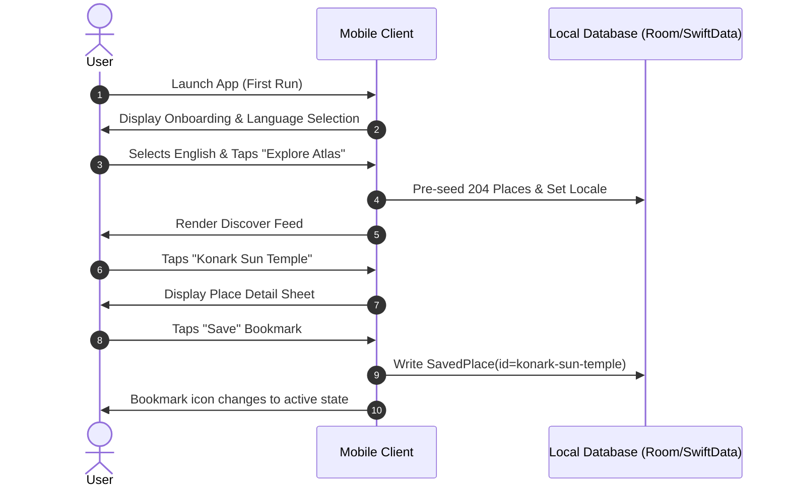

# O-TRAVELZ Mobile V4 — Twelve Golden Traveler Journeys

> **Authoritative User Journey Specification**  
> Scope: **Twelve End-to-End Golden Journeys with State Transitions and Truth Boundaries**
> Document Version: `4.1.0` | Last Updated: `2026-09-07` (Expanded to 12 Golden Scenarios in Wave M1)

---

## J1: First-Time Visitor Onboarding & Exploration

- **START STATE**: Fresh application launch after installation.
- **TRIGGER**: User taps app icon for the very first time.
- **STEPS**:
  1. System splash displays clean O-TRAVELZ emblem; transitions to `entry_onboarding`.
  2. User browses 3 introduction cards highlighting Verified Cultural Atlas, Deterministic Transit, and Zero-Cost Navigation.
  3. User selects preferred interface language (`English` or `Odia - ଓଡ଼ିଆ`).
  4. App presents initial Discover feed centered on Capital Region. No location dialog shown yet (progressive disclosure).
  5. User scrolls editorial feed and taps `Konark Sun Temple`.
  6. User inspects `place_detail` sheet and taps the "Save" bookmark.
- **DECISIONS**: Language choice (English vs Odia); saving destination to personal collection.
- **SYSTEM ACTIONS**: Initializes local SQLite / SwiftData database with pre-bundled 204 places; persists selected locale.
- **FAILURE BRANCHES**: If local pre-bundled DB read fails, app falls back to bundled JSON assets.
- **OFFLINE BRANCH**: 100% executable offline; onboarding does not require cellular connection.
- **TRUTH SURFACES**: Verified Official badge on Konark; ASI citation; authentic WebP photography.
- **END STATE**: User has selected language, viewed an authentic cultural profile, and saved their first destination.



---

## J2: Fast Spontaneous Discovery

- **START STATE**: App running in background or closed; user is physically standing in Old Town Bhubaneswar.
- **TRIGGER**: User opens app seeking immediate nearby heritage within walking distance.
- **STEPS**:
  1. User opens app and taps "Near Me" chip in the Discover tab.
  2. App displays context pre-permission explanation: *"O-TRAVELZ uses your location to show monuments within walking distance."*
  3. User grants "While Using App" location access.
  4. App retrieves hardware GPS coordinates (`20.2382, 85.8336`).
  5. Local engine computes Haversine distances; feed sorts by proximity: `Mukteshwar Temple (180m)`, `Parasurameswar (290m)`, `Lingaraj (650m)`.
  6. User taps `Mukteshwar Temple` to read architectural notes, then taps "View on Map".
  7. Map centers on user puck and Mukteshwar pin with walk polyline.
- **DECISIONS**: Granting location permission; selecting Mukteshwar over Lingaraj.
- **SYSTEM ACTIONS**: Transitions `LocationState` from `ReferenceOrigin` to `LiveDeviceLocation`; evaluates Haversine distances locally.
- **FAILURE BRANCHES**: If GPS times out (e.g. inside heavy stone temple), system gracefully defaults to Reference Datum with clear notification.
- **OFFLINE BRANCH**: Proximity math executes locally; pre-cached coordinates sort instantly without network.
- **TRUTH SURFACES**: Haversine straight-line distance badge `[↔ Estimated · 180m]`.
- **END STATE**: User stands before Mukteshwar Temple with deep architectural context on screen.

---

## J3: AI-Assisted Multi-Day Itinerary Planning

- **START STATE**: User in Planning Mode on the `Plan` tab.
- **TRIGGER**: User wishes to organize a 3-day family exploration of coastal Odisha.
- **STEPS**:
  1. User enters constraints: 3 Days, Starting Hub: Bhubaneswar Airport, Focus: Classical Art & Sun Temple, Mobility: Mo Bus + Short Auto.
  2. Deterministic solver calculates day schedules:
     - Day 1: Dhauli Shanti Stupa & Pipili Applique Village (Route 24 connection).
     - Day 2: Konark Sun Temple & Chandrabhaga Beach.
     - Day 3: Raghurajpur Heritage Craft Village & Puri Jagannath Temple.
  3. User reviews day-by-day cards and taps "Refine with AI".
  4. User types: *"Can we add a stop for authentic bell metal craft in Kantilo?"*
  5. AI Assistant analyzes travel matrix: Kantilo is 100 km west in Nayagarh, violating the 3-day coastal schedule.
  6. AI truthfully responds: *"Kantilo is 102 km west and would add 5 hours of driving, compromising your Konark visit. Instead, you can see certified Kantilo bell metal craft at the Ekamra Haat artisans hub in Bhubaneswar on Day 1."*
  7. User accepts recommendation; itinerary updates. User taps "Save Itinerary".
- **DECISIONS**: Deciding against unfeasible 100 km detour based on factual AI explanation.
- **SYSTEM ACTIONS**: Solves opening hours; runs feasibility check on route distances; updates local `SavedTrip`.
- **FAILURE BRANCHES**: If cloud AI is unreachable, RuleBasedAdapter provides static curated 3-day golden plan.
- **OFFLINE BRANCH**: Rule-based fallback generator runs 100% offline.
- **TRUTH SURFACES**: Feasibility warnings; distance citations; opening hours validation.
- **END STATE**: User has a verified, realistic 3-day itinerary saved on their device.

---

## J4: Six-Hour Bhubaneswar Layover Circuit (Benchmark Scenario)

- **START STATE**: Traveler lands at BBI Airport with a 6-hour layover before an onward evening train from Master Canteen.
- **TRIGGER**: Traveler launches Plan and taps "6-Hour Bhubaneswar Circuit" preset.
- **STEPS**:
  1. System locks origin: BBI Airport (`20.2520, 85.8178`), terminus: Master Canteen (`20.2660, 85.8436`), time window: 6.0 hours.
  2. Solver generates tight 3-stop circuit:
     - Stop 1: Odisha State Museum (2.5 km from airport, 1.5h visit).
     - Transit Hop: Mo Bus Route 10 to Rajarani Temple.
     - Stop 2: Rajarani Temple & garden grounds (1h visit).
     - Stop 3: Traditional Odia lunch near Master Canteen (1h).
  3. Solver reserves mandatory 45-minute buffer before scheduled train departure.
  4. Traveler taps "Start Trip" to lock active mode.
- **DECISIONS**: Starting active execution immediately.
- **SYSTEM ACTIONS**: Evaluates Route 10 scheduled departures; generates active checklist timeline.
- **FAILURE BRANCHES**: If State Museum is closed (Monday), solver automatically substitutes Mukteshwar Temple.
- **OFFLINE BRANCH**: Complete circuit and transit hops cached locally.
- **TRUTH SURFACES**: Scheduled Mo Bus departure times; strict opening hours constraint.
- **END STATE**: Traveler completes circuit and reaches Master Canteen 50 minutes before train departure.

---

## J5: Public Transit-Dependent Journey

- **START STATE**: Traveler at Master Canteen bus concourse needing to reach Konark Sun Temple via public bus.
- **TRIGGER**: Traveler searches transit options on the `Transit` portal.
- **STEPS**:
  1. Traveler inputs Origin: `Master Canteen`, Destination: `Konark`.
  2. App identifies direct CRUT Ama Bus service.
  3. Shows departure timeline: `Scheduled · 08:30 IST`, `Scheduled · 09:15 IST`.
  4. App displays explicit truth banner: *"Scheduled timetable departure. Live vehicle GPS tracking is not currently active on this corridor."*
  5. Traveler inspects stop sequence: 18 intermediate stops. Stop `Nimapada` highlighted as intermediate junction.
  6. Traveler boards bus, opens Stop Detail, and views route vector polyline.
- **DECISIONS**: Boarding the 08:30 IST bus.
- **SYSTEM ACTIONS**: Loads canonical route sequence from bundled transit database.
- **FAILURE BRANCHES**: If route is temporarily suspended, app shows official CRUT service advisory notice.
- **OFFLINE BRANCH**: All 154 routes and 5,549 canonical unique departures available offline.
- **TRUTH SURFACES**: `[◷ Scheduled · 08:30 IST]`, official CRUT operator citation, fare unavailable presentation notice.
- **END STATE**: Traveler rides transit with full confidence in schedule times and stopping sequences.

---

## J6: Active Trip Execution & Wayfinding

- **START STATE**: Active trip underway; traveler has just finished touring Dhauli Shanti Stupa.
- **TRIGGER**: Traveler marks Dhauli as "Visited"; app advances to next milestone: *"Next: Pipili Artisan Village"*.
- **STEPS**:
  1. Trips tab updates to highlight Leg 2: Dhauli $\rightarrow$ Pipili ($11.2\text{ km}$).
  2. First-Mile Engine evaluates current distance to Dhauli highway stop: $280\text{ m}$.
  3. Pill displays: `[🚶 Reasonable Walk · 4 mins]`.
  4. Traveler taps **Navigate**.
  5. System triggers external handoff via Universal URL:
     ```
     https://www.google.com/maps/dir/?api=1&destination=20.1147,85.8344&travelmode=driving
     ```
  6. External Google Maps opens instantly with turn-by-turn voice directions.
  7. Traveler completes drive, switches back to O-TRAVELZ, and marks Pipili as "Arrived".
- **DECISIONS**: Tapping external navigation handoff.
- **SYSTEM ACTIONS**: Advances `TripProgress` index; evaluates `FirstMileEngine.evaluate()`.
- **FAILURE BRANCHES**: If Google Maps is not installed, falls back to browser URL or Apple Maps on iOS.
- **OFFLINE BRANCH**: Offline maps handoff functions if user has offline maps saved in Google/Apple Maps.
- **TRUTH SURFACES**: FirstMileEngine 800m walking threshold; external deep link.
- **END STATE**: Traveler successfully arrives at Pipili craft village.

---

## J7: Weather Disruption & Truthful Adaptation

- **START STATE**: Traveler in Puri planning an afternoon open-air boat excursion on Chilika Lake.
- **TRIGGER**: Open-Meteo live API reports heavy squall and convective thunderstorm warning ($42\text{ mm}$ rain, wind gusts $55\text{ km/h}$).
- **STEPS**:
  1. App refreshes weather telemetry during periodic background refresh.
  2. Place detail for Chilika Lake / Satapada displays prominent weather alert badge: `[☁ Live · 26°C · Heavy Squall & High Wind]`.
  3. Itinerary card shows non-deceptive warning pill: *"Adverse weather condition detected at this outdoor site."*
  4. System does **NOT** autonomously rewrite the user's itinerary without consent (no fake "AI magic").
  5. User taps "Adjust Itinerary"; app offers indoor cultural alternatives in Puri District (Puri District Museum, Raghurajpur indoor craft workshops).
  6. User swaps outdoor boat leg for Raghurajpur indoor artisan visit.
- **DECISIONS**: User consciously swaps outdoor destination for covered heritage workshop.
- **SYSTEM ACTIONS**: Fetches live Open-Meteo telemetry; queries indoor category filter.
- **FAILURE BRANCHES**: If weather API is down, shows last cached observation with stale timestamp; never fabricates fake sunny weather.
- **OFFLINE BRANCH**: Displays last cached weather with explicit warning: *"Weather data from 3h ago"*.
- **TRUTH SURFACES**: Live Open-Meteo observation; category tags (`INDOOR_CULTURAL` vs `OUTDOOR_NATURE`).
- **END STATE**: Traveler avoids getting caught on an open boat in a squall and enjoys sheltered master craft demonstrations.

---

## J8: Deep Offline Exploration in Similipal National Park

- **START STATE**: Traveler drives past Jashipur into the deep core forest of Similipal. Cellular signal drops from 1 bar to "No Service".
- **TRIGGER**: Traveler opens app while cellular antenna is completely disconnected.
- **STEPS**:
  1. App launches in $<1.2\text{ s}$ without hanging or displaying network spinners.
  2. Persistent top indicator displays: `[Viewing cached offline atlas]`.
  3. Traveler opens saved itinerary: "Similipal Wilderness Circuit".
  4. Destination profiles for Barehipani Falls and Joranda Falls open instantly with cached 4:3 WebP photography and forest rest house coordinates.
  5. Straight-line Haversine distance from current GPS position to Barehipani evaluates locally: `14.2 km`.
  6. Traveler reviews emergency contact list: Baripada Forest Division control room telephone number visible.
- **DECISIONS**: Checking offline distance and entry gate rules.
- **SYSTEM ACTIONS**: Suppresses remote HTTP requests; serves all queries from Room / SwiftData local SQLite.
- **FAILURE BRANCHES**: If an uncached online feature is tapped, system shows informative dialog: *"Requires network. This feature will sync once you reconnect."*
- **OFFLINE BRANCH**: Primary flow.
- **TRUTH SURFACES**: Clear offline indicator; zero fake live claims.
- **END STATE**: Traveler navigates remote forest with complete peace of mind and zero data reception.

---

## J9: Emergency Essential Wayfinding

- **START STATE**: Traveler on highway between Cuttack and Dhenkanal experiences a sudden medical emergency.
- **TRIGGER**: Traveler taps "Emergency Essentials" floating shortcut in the `You` tab.
- **STEPS**:
  1. Essentials sheet opens immediately with category pills: `Hospital`, `Police 112`, `Tourist Police`, `Pharmacy`.
  2. User selects `Hospital`.
  3. App sorts verified civic facilities by distance from current GPS coordinates.
  4. Top hit: `Dhenkanal District Headquarter Hospital (DHH) · 4.8 km`.
  5. Displays verified official telephone number and 24x7 emergency casualty status.
  6. User taps "Call Hospital" $\rightarrow$ System launches native phone dialer with number pre-filled.
  7. User taps "Navigate" $\rightarrow$ Launches emergency driving directions in external Google Maps.
- **DECISIONS**: Calling hospital casualty desk and initiating route handoff.
- **SYSTEM ACTIONS**: Queries local verified essentials dataset; launches telephony and navigation intents.
- **FAILURE BRANCHES**: If location is disabled, lists state-level emergency helplines (112, 108 Ambulance).
- **OFFLINE BRANCH**: Emergency contacts are pre-bundled in the app binary.
- **TRUTH SURFACES**: Verified phone numbers; verified civic coordinates; separate from leisure destinations.
- **END STATE**: Medical assistance reached in minimal taps.

---

## J10: Community Ride Verification Check-In

- **START STATE**: Regular daily commuter or cultural traveler riding CRUT Mo Bus Route 24.
- **TRIGGER**: Bus stops at candidate stop `Patia Square Crossing`; traveler opens "Ride Verification".
- **STEPS**:
  1. User opens `You` $\rightarrow$ `Transit Check-In`.
  2. System detects user is moving along Route 24 corridor.
  3. Displays candidate stop: `Patia Square Crossing (Candidate High - 4 of 5 checks)`.
  4. User taps "Confirm Stop Arrival".
  5. System takes instant hardware GPS snapshot (`20.3551, 85.8190`) and records IST timestamp.
  6. Shared `RideVerificationEngine` processes observation: check-in count reaches 5.
  7. Stop is automatically staged for promotion to `VERIFIED_GEOSPATIAL` in the next catalog release.
  8. User sees rewarding confirmation: *"Thank you! Your check-in validated Patia Square Crossing for all Odisha travelers."*
- **DECISIONS**: Opting in to verify stop; confirming physical presence.
- **SYSTEM ACTIONS**: Records observation telemetry; executes consensus check.
- **FAILURE BRANCHES**: If user GPS is $>50\text{ m}$ away from candidate stop, observation is rejected as inaccurate.
- **OFFLINE BRANCH**: Observation stored in local pending queue; synced upon reconnection.
- **TRUTH SURFACES**: Consensus progress meter; candidate status disclosure.
- **END STATE**: Public transit knowledge graph improved through verified crowdsourcing.

---

## J11: Cultural Place Contribution & Photographic Submission

- **START STATE**: Cultural traveler visiting a rural handloom workshop in Nuapatna (Tigiria).
- **TRIGGER**: Traveler notices an exquisite traditional weaver cooperative not yet in the curated atlas.
- **STEPS**:
  1. User navigates to `You` $\rightarrow$ `Contribute to Atlas`.
  2. User inputs place name: `Nuapatna Khandua Pata Weaver Cooperative`.
  3. Selects category: `Traditional Handlooms & Crafts`, District: `Cuttack`.
  4. Uses CameraX / AVCapture to take authentic photograph of master weaver at loom.
  5. Adds descriptive notes on natural silk spinning and ties to Jagannath Gita Govinda textiles.
  6. User submits. App displays clear transparency notice: *"Submission received. In accordance with O-TRAVELZ quality standards, your contribution will be reviewed by human curators before appearing publicly."*
- **DECISIONS**: Capturing photo and submitting cultural documentation.
- **SYSTEM ACTIONS**: Saves photo to local cache; queues contribution payload for backend review.
- **FAILURE BRANCHES**: If submission fails due to connection drop, remains saved in local Drafts.
- **OFFLINE BRANCH**: Draft saved locally until online.
- **TRUTH SURFACES**: Audit staging queue transparency; no instant unvetted publishing.
- **END STATE**: High-value cultural intelligence added to staging inventory without compromising catalog truth.

---

## J12: Location Permission Denied Graceful Fallback

- **START STATE**: Privacy-conscious traveler installs the app.
- **TRIGGER**: First time an action requests location, traveler taps "Don't Allow".
- **STEPS**:
  1. System detects `LocationState.PermissionDenied`.
  2. App does **NOT** pop up nagging dialogs or block the screen.
  3. Discover feed cleanly displays an unobtrusive selector chip: *"Showing: Capital Region (Default). Tap to change district."*
  4. Traveler taps chip and manually selects `Sambalpur`.
  5. Feed instantly updates with Hirakud Reservoir, Samaleswari Temple, and Sambalpuri textile clusters.
  6. On Map tab, user marker is omitted; map smoothly centers on Sambalpur district center.
  7. On Place Detail, first-mile walking pill is cleanly suppressed (returns `null` per `FirstMileEngine` invariants).
- **DECISIONS**: Denying location permission; manually picking Sambalpur district.
- **SYSTEM ACTIONS**: Transitions to `LocationState.PermissionDenied`; suppresses first-mile walking calculations.
- **FAILURE BRANCHES**: None; 100% graceful degradation.
- **OFFLINE BRANCH**: District selection works completely offline.
- **TRUTH SURFACES**: No fake coordinates; explicit manual district filter state.
- **END STATE**: Traveler enjoys 100% functional catalog browsing with complete privacy sovereignty.
