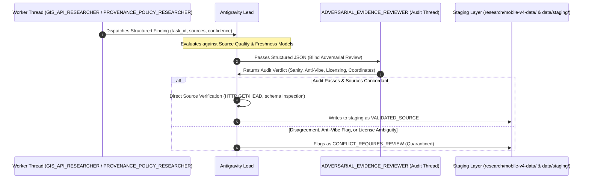

# O-TRAVELZ V4 — Cross-Validation Policy

## Purpose

This policy governs the independent research-thread verification protocol required before any research finding can be elevated to a `VALIDATED_SOURCE` candidate. It prevents hallucinations, confirms source legitimacy, and eliminates single-thread cognitive bias.

---

## The Cross-Validation Protocol (P1 Requirements)

All Priority 1 (P1) research findings (including transit stop coordinates, route geometries, attraction hours, admission fees, and verified media) must undergo the independent research-thread cross-validation gate:

---

## Core Invariants

### 1. Independent Research-Thread Cross-Validation
- Verification relies on **independent Antigravity research-thread cross-validation**. Findings gathered by one worker thread are adversarially reviewed by `ADVERSARIAL_EVIDENCE_REVIEWER` and verified against primary statutory sources by `ANTIGRAVITY_LEAD`.
- Model-family diversity is not required to validate evidence; evidence is validated through source primary provenance, URL inspection, and deterministic schema checks.

### 2. No Fact Averaging
- If Thread A discovers an entry fee of ₹50 and Thread B discovers ₹25, the orchestrator **must NOT** average them to ₹37.50.
- If Thread A finds opening hours are 06:00–18:00 and Thread B finds 08:00–17:00, do not synthesize an artificial union.
- In all discrepancies, mark the record as `CONFLICT_REQUIRES_REVIEW` and preserve both raw sources with their respective timestamps.

### 3. Blind Adversarial Audit
- `ADVERSARIAL_EVIDENCE_REVIEWER` receives structured JSON findings after research workers complete execution.
- Reviewer checks Anti-Vibe-Code constraints (no fabricated fares, no fake reviews, no AI-generated images), spatial coordinate bounds (`[17.78, 81.37, 22.57, 87.53]`), and open license compatibility.
- Reviewer does NOT perform web browsing unless a severe conflict, coordinate anomaly, or licensing ambiguity requires targeted verification.

### 4. Conflict Classification Matrix

| Scenario | Classification | Action |
|---|---|---|
| Dual threads cite identical Tier A source with matching data | `VALIDATED_SOURCE` | Antigravity checks URL; staged into `data/staging/`. |
| Thread A cites Tier A; Thread B cites Tier C (e.g. OSM differs from Govt Gazette) | `PRIMARY_SUPERSEDES_COMMUNITY` | Record Tier A value with audit note regarding community discrepancy. |
| Dual threads cite Tier A sources with conflicting values (e.g. outdated circular vs press release) | `CONFLICT_REQUIRES_REVIEW` | Quarantine in `data/staging/conflicts/`; escalate to human curator. |
| One thread finds source, other reports `NOT_FOUND` | `PARTIAL_UNVERIFIED` | Lead directly executes targeted endpoint check. |
