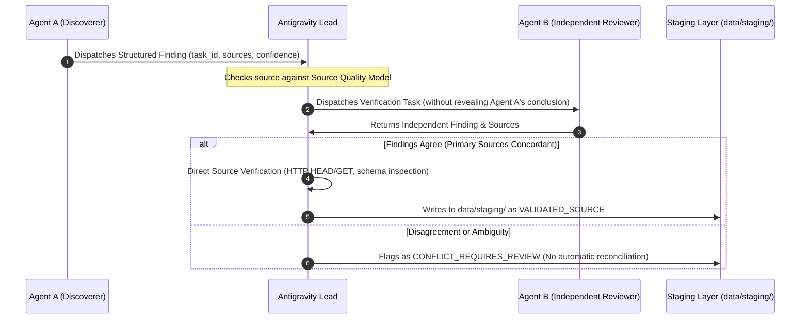

# O-TRAVELZ V4 — Cross-Validation Policy

## Purpose

This policy governs the multi-agent verification protocol required before any research finding can be elevated to a `VALIDATED_SOURCE` candidate. It prevents hallucinations, confirms source legitimacy, and eliminates single-agent cognitive bias.

---

## The Cross-Validation Protocol (P1 Requirements)

All Priority 1 (P1) research findings (including transit stop coordinates, route geometries, attraction hours, admission fees, and verified media) must undergo the three-stage cross-validation gate:

---

## Core Invariants

### 1. No Fact Averaging
- If Agent A discovers an entry fee of ₹50 and Agent B discovers ₹25, the orchestrator **must NOT** average them to ₹37.50.
- If Agent A finds opening hours are 06:00–18:00 and Agent B finds 08:00–17:00, do not synthesize an artificial union.
- In all discrepancies, mark the record as `CONFLICT_REQUIRES_REVIEW` and preserve both raw sources with their respective timestamps.

### 2. No Promotion on Model Consensus Alone
- Concordance between Gemini and Claude is a necessary condition, but **NOT** sufficient on its own.
- Antigravity Lead must directly verify the underlying HTTP source URL, confirm its HTTPS response, check domain ownership (`.gov.in`, `.org`, official operator), and inspect the raw text/JSON.

### 3. Blind Independent Review
- When Agent B is tasked with reviewing an Agent A discovery, Agent B must be supplied with the *research question and entity identity*, not Agent A's pre-chewed conclusions.
- This prevents conversational sycophancy or confirmation bias.

### 4. Conflict Classification Matrix

| Scenario | Classification | Action |
|---|---|---|
| Both agents cite identical Tier A source with matching data | `VALIDATED_SOURCE` | Antigravity checks URL; staged into `data/staging/`. |
| Agent A cites Tier A; Agent B cites Tier C (e.g. OSM differs from Govt Gazette) | `PRIMARY_SUPERSEDES_COMMUNITY` | Record Tier A value with audit note regarding community discrepancy. |
| Both agents cite Tier A sources with conflicting values (e.g., outdated circular vs. press release) | `CONFLICT_REQUIRES_REVIEW` | Quarantine in `data/staging/conflicts/`; escalate to human curator. |
| One agent finds source, other reports `NOT_FOUND` | `PARTIAL_UNVERIFIED` | Lead directly executes targeted endpoint check. |
