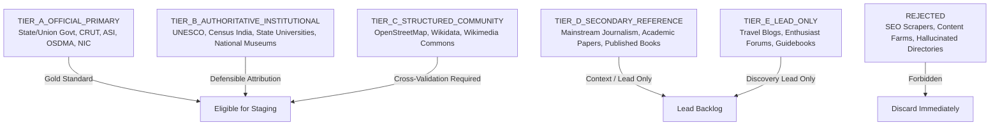

# O-TRAVELZ V4 — Source Quality Model

## Purpose

To prevent data fabrication and preserve truth boundaries across the Odisha Cultural Atlas and transit graph, all data discovered by research subagents must be classified according to this 6-tier Source Quality Model.

Source quality evaluates **institutional defensibility, provenance, and legal authority**. It is evaluated independently of temporal freshness.

---

## The 6-Tier Hierarchy

---

## Detailed Tier Definitions

| Tier Code | Label | Eligible Sources & Examples | Canonical Operational Claims Permitted? |
|---|---|---|---|
| `TIER_A` | `TIER_A_OFFICIAL_PRIMARY` | Direct governmental custodians: `*.gov.in`, `*.nic.in`, CRUT / Mo Bus official portal, Odisha Tourism portal, Archaeological Survey of India (ASI), Odisha State Disaster Management Authority (OSDMA). | **YES** — Primary source of truth for opening hours, fees, routes, official monument names. |
| `TIER_B` | `TIER_B_AUTHORITATIVE_INSTITUTIONAL` | Recognized non-governmental or multilateral authorities: UNESCO World Heritage Centre, Census of India data repositories, Anthropological Survey of India, Indira Gandhi National Centre for the Arts (IGNCA). | **YES** (with explicit provenance tracking) — Monument history, cultural taxonomy, district statistics. |
| `TIER_C` | `TIER_C_STRUCTURED_COMMUNITY` | Verifiable collaborative open datasets: OpenStreetMap (OSM node/way geometries), Wikidata entity identifiers, Wikimedia Commons verified image metadata. | **CONDITIONAL** — Allowed for spatial boundary cross-checking and initial coordinate seed, but requires verification against satellite or Tier A/B. |
| `TIER_D` | `TIER_D_SECONDARY_REFERENCE` | Reputable third-party publications: Peer-reviewed historical journal articles, The Hindu / Indian Express investigative reports, published university presses. | **NO for operational facts** (hours, fees, schedules). Allowed solely for narrative context, festival calendars, and editorial leads. |
| `TIER_E` | `TIER_E_LEAD_ONLY` | Commercial travel guides, lifestyle blogs, personal travelogues, tourism forum posts (e.g. IndiaMike, TripAdvisor forums). | **STRICTLY NO**. May only be used to generate candidate hypotheses for Tier A investigation. |
| `REJECTED` | `REJECTED` | AI content farms, automated aggregators, scraped directory portals with fabricated telephone numbers, unverified reviews, and promotional sponsored spam. | **PERMANENTLY DISALLOWED**. Must be discarded immediately and blacklisted. |

---

## Operating Rules

1. **No Operational Claims on Tier D/E**: Never set entry fees, ticket costs, opening hours, or bus departure times based on blog posts or aggregators.
2. **Strict Separation from Freshness**: A Tier A source (e.g., a 2012 Government Gazette) is authoritative regarding statutory boundaries, but stale regarding seasonal festival schedules. Both dimensions must be recorded.
3. **Image Provenance Verification**: All destination media must trace to Tier A (official state releases), Tier B (institutional archives), or Tier C (Wikimedia Commons CC/PD with verified EXIF and upload attribution). `NO VERIFIED IMAGE = NO PUBLIC DESTINATION`.
4. **Transit Graph Rule**: Transit stops, route IDs, and service schedules may ONLY derive from Tier A (CRUT / Ama Bus official data).
