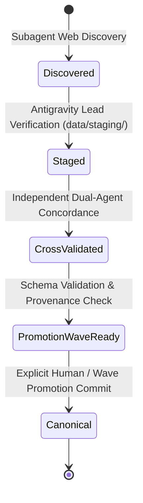

# O-TRAVELZ V4 — Staging and Promotion Policy

## Purpose

This document establishes the quarantine, staging, and promotion boundaries separating raw subagent research findings from canonical production data.

---

## Allowed Staging Directories

Research subagents and orchestration tools are strictly confined to writing output within the following directories:

1. `research/` — Research backlogs, gap analysis registries, and task specifications.
2. `data/research/` — Raw harvested payloads, sample JSON responses, and API specification snapshots.
3. `data/staging/` — Candidate entities, normalized candidate stops, verified media URLs, and cross-validated candidate schemas.
4. `reports/research/` — Audit reports, capability scans, and validation test summaries.

---

## Strictly Protected Canonical Boundaries

Under NO circumstances may subagents or automated workflows modify or write to:

- `data/**/canonical/` (e.g. `data/transport/canonical/`, `data/places/places.json`)
- Production databases (Aiven PostgreSQL / PostGIS runtime)
- Backend canonical seed data (`backend/app/db/seeds/`)
- Mobile embedded assets (`mobile/android/src/main/assets/places_canonical_fallback.json`, iOS bundles)

---

## The Promotion Lifecycle

### Promotion Requirements

To promote any entity from `data/staging/` to `canonical/`:
1. **Tier A or Tier B Provenance**: The source must satisfy Tier A (Official Primary) or Tier B (Institutional Authoritative) in [`docs/research/SOURCE_QUALITY_MODEL.md`](./SOURCE_QUALITY_MODEL.md).
2. **Deterministic Schema Conformance**: The entity must strictly conform to the OpenAPI / KMP shared domain models.
3. **Verified Image Gate**: For destinations, a verified, authentic image meeting WebP standards must be present (`NO VERIFIED IMAGE = NO PUBLIC DESTINATION`).
4. **Transit Graph Rule**: Any stop coordinate updates must preserve existing stop IDs and route topologies without breaking timetable evaluation parity.
5. **Explicit Wave Authorization**: Promotion must happen in a dedicated Git commit with clear provenance attribution and verification logs. Automated, continuous, or silent promotions are forbidden.
