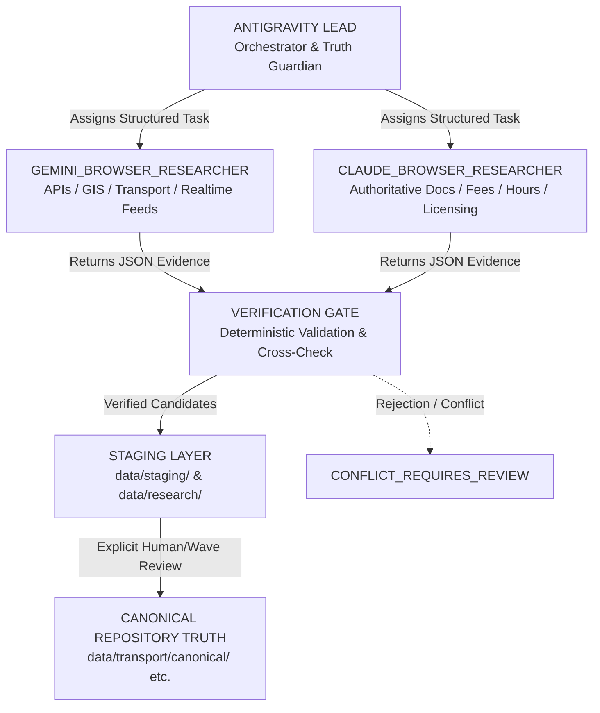

# O-TRAVELZ V4 — Research Subagent Orchestration Architecture

## Overview

To accelerate the O-TRAVELZ V4 rebuild without compromising repository truth, Antigravity orchestrates dual specialized research subagents (`GEMINI_BROWSER_RESEARCHER` and `CLAUDE_BROWSER_RESEARCHER`) operating concurrently in the background while mobile implementation proceeds uninterrupted.

Research subagents are **fact gatherers and evidence collectors**, NOT canonical authorities. They never modify canonical repository data, production databases, or feature code.

---

## Topology

---

## Agent Roles & Division of Labor

### 1. ANTIGRAVITY_LEAD (Parent Session)
- **Role**: Platform architect, repository truth guardian, and orchestrator.
- **Responsibilities**:
  1. Inspect and defend canonical repository truth (`data/transport/canonical/`, verified places inventory).
  2. Maintain the research gap backlog (`research/mobile-v4-data/DATA_GAP_REGISTRY.json`).
  3. Dispatch bounded, unambiguous research tasks to subagents.
  4. Prevent duplicate research queries and redundant web traffic.
  5. Ingest structured subagent output via reactive system notifications.
  6. Enforce Cross-Validation Policy on high-priority (P1) discoveries.
  7. Run verification scripts against returned endpoints/URLs.
  8. Stage valid evidence into `data/staging/` or `data/research/`.
  9. **Strict boundary**: NEVER automatically promote staged findings to canonical files.
  10. Continue Mobile V4 implementation tasks (Compose, Swift, KMP shared core) independently while subagents run.

### 2. GEMINI_BROWSER_RESEARCHER (Specialized Subagent)
- **Mission**: Discover machine-readable, structured, geospatial, API, transit, and technical data sources.
- **Domains**:
  - Open transit APIs, GTFS static, GTFS-Realtime feeds
  - GeoJSON, ArcGIS REST endpoints, FeatureServer, MapServer, WMS, WFS, KML
  - Government open-data portals, Odisha GIS, State Spatial Data Infrastructure
  - CRUT / Mo Bus / Ama Bus structured data, unresolved stop coordinates, route geometry
  - Weather-warning feeds, civic amenities GIS layers
- **Runtime**: Native Antigravity subagent (`gemini_browser_researcher`) equipped with `search_web` and `read_url_content`.

### 3. CLAUDE_BROWSER_RESEARCHER (Specialized Subagent)
- **Mission**: Discover authoritative documents, operational facts, licensing, provenance, accessibility evidence, media sources, and policy constraints.
- **Domains**:
  - Odisha Tourism official portals, district NIC portals (`<district>.nic.in`)
  - ASI (Archaeological Survey of India) protected monuments, UNESCO listings
  - Official monument/attraction opening hours, entry fees, weekly closures, camera rules
  - Visitor accessibility evidence (ramps, wheelchairs, terrain limitations)
  - Official contact numbers, administrative jurisdiction, artisan/craft cooperatives, GI tags
  - Public domain and CC-licensed photography provenance (Wikimedia Commons)
  - Legal reuse constraints, copyright, attribution guidelines
- **Runtime**: Native Antigravity subagent (`claude_browser_researcher`) operating on the deep-reasoning `pro` model with strict source-criticism prompt, or standby external CLI (`claude.cmd`).

### 4. VERIFICATION_GATE
- Deterministic filter applied by Antigravity Lead before any finding is recorded into staging.
- Evaluates source tier against [`docs/research/SOURCE_QUALITY_MODEL.md`](./SOURCE_QUALITY_MODEL.md).
- Evaluates freshness against [`docs/research/FRESHNESS_MODEL.md`](./FRESHNESS_MODEL.md).
- Enforces cross-validation per [`docs/research/CROSS_VALIDATION_POLICY.md`](./CROSS_VALIDATION_POLICY.md).

---

## Operating Invariants

1. **Subagents Are Not Authorities**: Subagents collect candidate facts and verifiable links; only vetted records can be staged.
2. **Canonical Data Freeze**: Neither subagents nor automated scripts may edit files under `data/**/canonical/`.
3. **No Unauthenticated Secret Scraping**: Strictly obey [`docs/research/RESEARCH_SAFETY_POLICY.md`](./RESEARCH_SAFETY_POLICY.md).
4. **Structured JSON Output Only**: No conversational essays or prose dumps; all findings must match the standard schema.
5. **Deterministic Lead Control**: Subagent lifecycle is governed via `define_subagent`, `invoke_subagent`, `manage_subagents`, and `send_message`.
